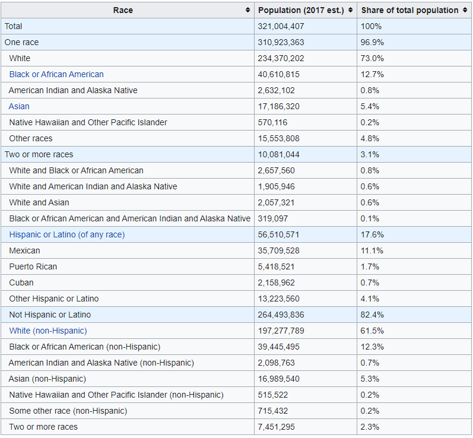
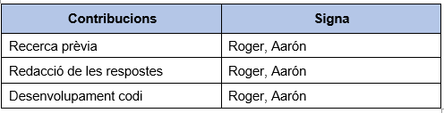

# 1. Descripció del dataset. Perquè és important i quina pregunta/problema pretén respondre?

Aquest darrer any hem vist com han augmentat considerablement les manifestacions del moviment Black Lives Matter amb motiu de [l'assassinat del ciutadà George Floyd en mans de l'actualment expolicia Derek Chauvin](https://www.europapress.es/internacional/noticia-sentencia-contra-expolicia-asesino-george-floyd-leera-16-junio-20210424033426.html). Però no pareix ser un cas aïllat. Ja durant el 2014 hi va haver forts disturbis a la ciutat de Fergusson com a resposta per l'assassinat a mans d'una policia de Michael Brown, un jove Afroamericà de 18 anys.

En aquest context, el Washington Post va començar a recollir tots els tirotejos amb víctimes mortals causades per policies als Estats Units. A [kaggle](https://www.kaggle.com/kwullum/fatal-police-shootings-in-the-us?select=ShareRaceByCity.csv) hem trobat un conjunt de datasets amb aquestes dades que ens poden ajudar a analitzar aquesta situació. A més de les dades dels enfrontaments amb víctimes mortals, també disposem de quatre datasets més amb informació relativa a les ciutats dels Estats Units. Aquesta informació ens serà molt útil per a analitzar més en profunditat si hi ha diferencies entre ciutats respecte a les ètnies predominants de cadascuna.

Algunes de les preguntes que volem respondre a partir de les dades són les següents:

- Hi ha diferències d'ingressos mitjans d'una ciutat depenent de la distribució d'ètnies?
- Les ciutats es poden agrupar per alguna característica?
- Podem estimar els ingressos mitjans d'una ciutat?
- Les víctimes mortals pertanyen majoritàriament a alguna ètnia?
- Predomina algun rang d'edat entre les persones que han sigut abatudes? Hi ha diferències entre ètnies?

Així, els datasets d'interés són els següents:
```{r, eval=TRUE, echo=TRUE}
#df_householdIncome <- read.csv("/Users/rogerpardellcarrera/Desktop/UOC/Tipologia i cicle de vida de les dades/Pràctica 2/Dataset/MedianHouseholdIncome2015.csv")
#df_poverty <- read.csv("/Users/rogerpardellcarrera/Desktop/UOC/Tipologia i cicle de vida de les dades/Pràctica 2/Dataset/PercentagePeopleBelowPovertyLevel.csv")
#df_highSchool <- read.csv("/Users/rogerpardellcarrera/Desktop/UOC/Tipologia i cicle de vida de les dades/Pràctica 2/Dataset/PercentOver25CompletedHighSchool.csv")
#df_policeKilling <- read.csv("/Users/rogerpardellcarrera/Desktop/UOC/Tipologia i cicle de vida de les dades/Pràctica 2/Dataset/PoliceKillingsUS.csv")
#df_shareRace <- read.csv("/Users/rogerpardellcarrera/Desktop/UOC/Tipologia i cicle de vida de les dades/Pràctica 2/Dataset/ShareRaceByCity.csv")

df_householdIncome <- read.csv("data/MedianHouseholdIncome2015.csv")
df_poverty <- read.csv("data/PercentagePeopleBelowPovertyLevel.csv")
df_highSchool <- read.csv("data/PercentOver25CompletedHighSchool.csv")
df_policeKilling <- read.csv("data/PoliceKillingsUS.csv")
df_shareRace <- read.csv("data/ShareRaceByCity.csv")
```

Analitzem individualment cadascun dels datasets amb l'ajuda de la funció str():
```{r, eval=TRUE, echo=TRUE}
str(df_householdIncome)
```

Aquest conté les dades dels ingressos mitjans per família. Consta de 29322 registres i 3 variables. Les variables són:

- Geographic.Area: Tipus character. Conte les inicials dels estats al qual pertany la ciutat.
- City: Tipus character. Nom de la ciutat.
- Median.Income: Tipus character, més endavant ens serà necessari passar-lo a numèric. Representa la mitjana d'ingressos.

```{r, eval=TRUE, echo=TRUE}
str(df_poverty)
```

Pel que fa a df_poverty, representa el percentatge de pobresa de les ciutats. Té 29329 registres amb 3 variables.

Com també df_householdIncome té les variables Geographic.Area i City. La tercera variable, poverty_rate, és de tipus character i indica el percentatge de pobresa en la ciutat.

```{r, eval=TRUE, echo=TRUE}
str(df_highSchool)
```

Aquest tercer dataset conté també informació sobre les ciutats. Té 29329 registres amb tres variables. Inclou Geographic.Area i City. A més podem veure la variable percent_completed_hs amb el percentatge de gent que ha superat estudis superiors.

```{r, eval=TRUE, echo=TRUE}
str(df_shareRace)
```

I aquest és l'últim amb informació sobre les ciutats. Té 29628 registres amb 7 variables.

A més de area_geografica i City inclou la distribució d'ètnies en la ciutat. Les variables que representen el percentatge de cada ètnia són:

- share_white
- share_black
- share_native_american
- share_asian          
- share_hispanic       

```{r, eval=TRUE, echo=TRUE}
str(df_policeKilling)
```

El dataset df_policeKilling mostra totes les víctimes mortals en mans de la policia. En total, tenim 2535 observacions i 14 atributs, entre els quals hi trobem l'edat, l'estat i la ciutat on ha succeït i la manera en què han mort.

Per finalitzar aquest punt, dir que aquests cinc conjunts aporten les característiques individuals de les víctimes, així com les variables ambientals de les ciutats on han succeït els assassinats. Així, se'ns permet fer una anàlisi més holística de la situació.

# 2. Integració i selecció de les dades d’interès a analitzar.

Per a fer les nostres anàlisis crearem un dataset un amb totes les dades referents a informació sobre les ciutats relacionades amb la informació de les persones assassinades.

En primer lloc carreguem les llibreries que utilitzarem al llarg de la pràctica:
```{r, eval=TRUE, echo=TRUE}
library(dplyr)
library(ggplot2)
library(gridExtra)
library(magrittr)
```

Canviem el nom de la columna Geographic.area per a després fer la mescla de les dades:
```{r, eval=TRUE, echo=TRUE}
colnames(df_householdIncome)[1] <- "area_geografica"
colnames(df_poverty)[1] <- "area_geografica"
colnames(df_highSchool)[1] <- "area_geografica"
colnames(df_shareRace)[1] <- "area_geografica"
```

Mesclem els distints datasets i obtenim el dataset USA que contindrà tota la informació respectiva a les ciutats:
```{r, eval=TRUE, echo=TRUE}
USAv1 <- merge(df_highSchool, df_poverty, by.x=c("area_geografica", "City"), by.y=c("area_geografica", "City"))
USAv2 <- merge(USAv1, df_householdIncome, by.x=c("area_geografica", "City"), by.y=c("area_geografica", "City"))
USA <- merge(USAv2, df_shareRace, by.x=c("area_geografica", "City"), by.y=c("area_geografica", "City"))
```

Normalitzem els noms de les ciutats per fer la mescla de la informació de les ciutats i les persones assassinades:
```{r, eval=TRUE, echo=TRUE}
USA$City <- gsub(" CDP| city| town|\\.| ","", USA$City)
df_policeKilling$city <- gsub(" County| Parish|[^[:alnum:]]","",df_policeKilling$city)
```

Mesclem del dataset obtingut amb df_policeKilling:
```{r, eval=TRUE, echo=TRUE}
df_clean <- merge(df_policeKilling, USA, by.x=c("state", "city"), by.y=c("area_geografica", "City"))

# Eliminem aquesta, ja que en aquest cas no ens aporta informacio rellevant
df_clean$id <- NULL

# Convertim el camp date de tipus character a tipus date
df_clean %<>% mutate(date=as.Date(date, format = "%d/%m/%y"))

rownames(df_clean) <- 1:nrow(df_clean)
```

# 3. Neteja de les dades.

Tractar camp Median.Income:
```{r, eval=TRUE, echo=TRUE}
table(df_clean$Median.Income)[1:5]
# Hem vist que la variable Median.Income te el valor "-" i "(X)", els subtituim per 0
df_clean[df_clean$Median.Income == "-",]$Median.Income <- "0"
df_clean[df_clean$Median.Income == "(X)",]$Median.Income <- "0"
# Convertim la variable a tipus numeric
df_clean$Median.Income <- as.numeric(df_clean$Median.Income)
# Calculem la mitjana i la asignem als valors que haviem subtituit abans
mean_income <- mean(df_clean[df_clean$Median.Income > 0,]$Median.Income)
df_clean$Median.Income[df_clean$Median.Income == 0] <- mean_income
```

Continuem amb el tractament de les dades:

- Passarem les variables: manner_of_death, armed, gender, race, threat_level i flee a tipus factor.
- I les variables: percent_completed_hs, poverty_rate, share_white, share_asian, share_black, share_native_american i share_hispanic a tipus numeric.

```{r, eval=TRUE, echo=TRUE}
df_clean$manner_of_death <- as.factor(df_clean$manner_of_death)
df_clean$armed <- as.factor(df_clean$armed)
df_clean$gender <- as.factor(df_clean$gender)
df_clean$race <- as.factor(df_clean$race)
df_clean$threat_level <- as.factor(df_clean$threat_level)
df_clean$flee <- as.factor(df_clean$flee)
df_clean$percent_completed_hs <- as.numeric(df_clean$percent_completed_hs)
df_clean$poverty_rate <- as.numeric(df_clean$poverty_rate)
df_clean$share_white <- as.numeric(df_clean$share_white)
df_clean$share_asian <- as.numeric(df_clean$share_asian)
df_clean$share_black <- as.numeric(df_clean$share_black)
df_clean$share_native_american <- as.numeric(df_clean$share_native_american)
df_clean$share_hispanic <- as.numeric(df_clean$share_hispanic)
head(df_clean)
```


## Valors buits, extrems i zeros

Una vegada tenim les dades en el format que volem, comprovem si hi ha algun valor buit en tot el dataframe:
```{r, eval=TRUE, echo=TRUE}
colSums(is.na(df_clean))
```

__age__

Vegem que tenim 71 edats desconegudes.
```{r echo=TRUE, message=FALSE, warning=FALSE}
boxplot(df_clean$age)$out
```

Tenim uns quants valors extrems en la variable edat, que corresponen a edats majors de 70 anys. Com aquest valors podrien influir en la mitjana, anem a assignar als valors NA la mediana, que es mes robusta contra aquests efectes.
```{r echo=TRUE, message=FALSE, warning=FALSE}
df_clean$age[is.na(df_clean$age)] <- median(df_clean$age[!is.na(df_clean$age)])
colSums(is.na(df_clean))
```

Ja no tenim valors NA en cap variable. Comprovem si hi ha elements amb cadena buida.
```{r echo=TRUE, message=FALSE, warning=FALSE}
colSums(df_clean == "")
```
__date__

Ens indica que hi ha valors NA en date, ho comprovem.
```{r echo=TRUE, message=FALSE, warning=FALSE}
which(is.na(df_clean$date))
```

En la comprovació ens diu que no hi ha cap valor de date amb NA.

__armed__

Com son sols 8 registres, els eliminarem
```{r echo=TRUE, message=FALSE, warning=FALSE}
df_clean <- df_clean[df_clean$armed != "",]
```

__race__

Aquestes dades seran una mica més complicades, ja que no son valors numèrics, sinó classes a les que pot pertanyer el registre. Una possible solució seria la d'imputar tots aquest valors buits al grup majoritari.
Vegem com es distribueixen.
```{r echo=TRUE, message=FALSE, warning=FALSE}
table(df_clean$race)
```
El grup més nombrós és "White". Tot i aço, no podem assignar-li els 167 registres, ja que després podria fer-nos caure en anàlisis erronis pel fet d'estar inflant aquest grup. Com que no és una gran quantitat de registres respecte al total, les eliminarem.

```{r echo=TRUE, message=FALSE, warning=FALSE}
df_clean <- df_clean[df_clean$race != "",]
```

__flee__
```{r echo=TRUE, message=FALSE, warning=FALSE}
table(df_clean$flee)
```

Tenim una situació semblant a la variable race. Com que són sols 44 registres, els eliminarem.
```{r echo=TRUE, message=FALSE, warning=FALSE}
df_clean <- df_clean[df_clean$flee != "",]
```

Comprovem que els canvis s'han realitzar correctament:
```{r echo=TRUE, message=FALSE, warning=FALSE}
colSums(df_clean == "")
```

No tenim cap valor buit.

Per últim, comprovem si hi ha registres amb el valor 0:
```{r, eval=TRUE, echo=TRUE}
colSums(df_clean == 0)
```

Podem observar zeros en:

- signs_of_mental_illness
- body_camera
- poverty_rate
- share_black
- share_native_american
- share_asian
- share_hispanic 

signs_of_mental_illness i body_camera són variables dicotòmiques on 0 significarà que no i 1 que si, així que és correcte que existeixin registres amb zeros.

Que hi haja un registres amb zero en poverty_rate és excepcional, però no és una data irreal. Podria ser que alguna ciutat petita no existira cap persona en la pobresa. Vegem quina ciutat és:
```{r echo=TRUE, message=FALSE, warning=FALSE}
df_clean[df_clean$poverty_rate == 0,]
```

La ciutat és Huntley, Montana. Efectivament, és una ciutat amb molt pocs habitants. Com [podem observar](https://es.wikipedia.org/wiki/Huntley_(Montana)), amb data de 2010 tenia 446 habitants.

I per últim, pel que fa als zeros en les variables de percentatge d'ètnies, no són molts registres respecte al total, així que no és estrany que en algunes ciutats no hi haja ciutadans d'alguna de les ètnies.

En aquest punt ja tenim les dades tractades. Per finalitzar, comprovem que estan amb el tipus de dades adequat.
```{r echo=TRUE, message=FALSE, warning=FALSE}
str(df_clean)
```

# 4 i 5. Anàlisi de les dades i representació dels resultats a partir de taules i gràfiques.

En aquest punt hem decidit ajuntar els punts 4 i 5 de l'enunciat per a fer en primer lloc una anàlisi mitjançant taules i gràfiques de les relacions que podem observar d'algunes variables que ens interessin i després passar a fer anàlisis amb més profunditat de les dades.

## Analisis exploratori de les dades

Ens centrarem en les relacions de les següents característiques: edat, gènere, ètnia, nivell de pobresa, nivell d'estudis, ingressos mitjans, el tipus d'amenaça i la forma de morir.

__Distribució per edats__

En primer lloc mirarem si la distribució de l'edat és igual a totes les races:
```{r, eval=TRUE, echo=TRUE}
ggplot(df_clean) + geom_density(aes(x = age, colour=race, group=race)) + geom_density(aes(x = age), size = 1) +
  theme_classic() + xlab("Edat") + ylab("Densitat")
```

Com es pot observar, les persones assassinades d'ètnia negra, hispana o nativa americana tenen una distribució de les edats bastant similar. Les edats de les persones asiàtiques són una mica més majors, però on es veu una diferència més gran és amb les persones blanques. Aquestes persones són més majors, no s'agrupen tant entorn als 20-30 anys com les altres.

Observem gràficament si la variable edat segueix una distribució normal o no amb un gràfic QQ-plot:
```{r}
qqnorm(df_clean$age, pch = 1, frame = FALSE)
qqline(df_clean$age, col = "steelblue", lwd = 2)
```

Pareix que s'ajusta, però els punts als extrems s'allunyen de la línia de normalitat. Ara bé, són significatives aquestes diferències respecte a la normalitat? Ho comprovarem a través del test de Shapiro-Wilks. Aquest mètode compara la distribució presentada amb una distribució normal. La hipòtesi nul·la considera que no hi ha diferència entre ambdues distribucions, mentre que la hipòtesi alternativa diu que sí hi ha diferència. Per tant, si el p valor és més gran de 0'05, assumirem que la distribució de la nostra variable és normal.

```{r}
shapiro.test(df_clean$age)
```
El resultat del test ens fa rebutjar la hipòtesi nula i acceptar l'alternativa. Per tant, podem concloure que la distribució de la variable edat no és normal. 

__Distribució per gèneres__

Vegem també la distribució per sexes:
```{r, eval=TRUE, echo=TRUE}
ggplot(df_clean) + geom_bar(map = aes(gender, fill=gender)) + theme_classic() + xlab("Gènere binari") +
  ylab("Num. observacions")
```

Podem destacar que, clarament, la gran majoria de persones disparades són homes.

__Distribució d'ètnies__

Vegem ara com es distribueixen les races de les persones disparades:
```{r, eval=TRUE, echo=TRUE}
ggplot(df_clean) + geom_bar(map = aes(race, fill=race)) + theme_classic() + xlab("Raça") +
  ylab("Num. observacions")
```

De qui més registres tenim és de les persones blanques. És lògic veure aquests resultats, ja que la majoria de persones en Estats Units són de blanques, però, quina és la proporció de víctimes de cada respectiva ètnia respecte al total de persones d'eixa ètnia?

Per comprovar-ho, consultarem la següent [gràfica](https://en.wikipedia.org/wiki/Demographics_of_the_United_States) que té informació sobre el cens per ètnia als Estats Units en 2017.



```{r, eval=TRUE, echo=TRUE}
summary(df_clean$date)
```

La data mínima de les nostres dades és 02/01/2015 i la màxima, 31/07/2017.

Vegem el gràfic de les víctimes de tirs tenint en compte la població total de cada ètnia:
```{r, eval=TRUE, echo=TRUE}
races_total <- c((sum(df_clean$race == 'A') / 17186320), (sum(df_clean$race == 'B') / 40610815), (sum(df_clean$race == 'H') / 56510571), (sum(df_clean$race == 'N') / 2632102) , (sum(df_clean$race == 'O') / 15553808), (sum(df_clean$race == 'W') / 234370202))

# Etiquetes
races <- c('A', 'B', 'H', 'N', 'O', 'W')

barplot(races_total, names.arg = races)
```

Veient el gràfic amb les dades comparades amb el total de població de cada ètnia pareix indicar que les persones negres, natives americanes i hispanes són més probables de ser assassinades per la bala d'un policia que una persona blanca.

__Poverty i high school per ètnies__

Per analitzar un poc mes en profunditat algunes possibles relacions entre les persones que han sigut disparades, discretitzarem les variables percent_completed_hs i poverty_rate. Dividirem els seus valors per franges d'igual freqüència, és a dir, a partir dels quantils 25, 50 i 75:
```{r, eval=TRUE, echo=TRUE}
# Percentatge de graduat escolar escolar
quantil1e <- quantile(df_clean$percent_completed_hs, 0.25)
quantil2e <- quantile(df_clean$percent_completed_hs, 0.5)
quantil3e <- quantile(df_clean$percent_completed_hs, 0.75)

df_clean$range_highSchool <- "7'9 (min) - 80"
df_clean[(df_clean$percent_completed_hs >= quantil1e & df_clean$percent_completed_hs < quantil2e),]$range_highSchool <- "80 - 85"
df_clean[(df_clean$percent_completed_hs >= quantil2e & df_clean$percent_completed_hs < quantil3e),]$range_highSchool <- "85 - 89"
df_clean[(df_clean$percent_completed_hs >= quantil3e),]$range_highSchool <- "89 - 100"
df_clean$range_highSchool <- as.factor(df_clean$range_highSchool)

# Percentatge de taxa de pobresa
quantil1p <- quantile(df_clean$poverty_rate, 0.25)
quantil2p <- quantile(df_clean$poverty_rate, 0.5)
quantil3p <- quantile(df_clean$poverty_rate, 0.75)

df_clean$range_poverty <- "0 - 15"
df_clean[(df_clean$poverty_rate >= quantil1p & df_clean$poverty_rate < quantil2p),]$range_poverty <- "15 - 20"
df_clean[(df_clean$poverty_rate >= quantil2p & df_clean$poverty_rate < quantil3p),]$range_poverty <- "20 - 24"
df_clean[(df_clean$poverty_rate >= quantil3p),]$range_poverty <- "24 - 76'4 (max)"
df_clean$range_poverty <- as.factor(df_clean$range_poverty)
```


Vegem la freqüència de les dades en aquestes franges:
```{r, eval=TRUE, echo=TRUE}
round(table(df_clean$range_highSchool)/nrow(df_clean),3)
round(table(df_clean$range_poverty)/nrow(df_clean),3)
```

Analitzem-ho gràficament:
```{r, eval=TRUE, echo=TRUE}
ggplot(df_clean) + geom_bar(map = aes(x = range_highSchool, fill=race), position = "fill") + theme_classic() + xlab("Percentatge de gent amb grau escolar") + ylab("Num. observacions")
```

Si considerem que les persones assassinades eren d'aquella ciutat, podem veure que, a mesura que augmenta el nivell ecolar, més percentatge de blancs hi trobem. En l'altre extrem, els hispans viuen en zones amb un baix nivell escolar. 

```{r, eval=TRUE, echo=TRUE}
ggplot(df_clean) + geom_bar(map = aes(x = range_poverty, fill=race), position = "fill") + theme_classic() + xlab("Taxa de pobresa") + ylab("Num. observacions")
```

Seguint la lògica del gràfic anterior, a mesura que augmenta la taxa de pobresa, disminueix el percentatge de blancs mentre augmenta la de negres i hispans. Curiosament, en el grup amb major pobresa, el percentatge de blancs augmenta respecte al grup anterior, mentre que retrocedeix el grup d'hispans.

__Median Income per ètnies__

En aquest apartat compararem la distribució de l'ingrés mitja de les ciutats tenint en compte la representació de cada ètnia.
```{r, eval=TRUE, echo=TRUE}
plot_share_white <- ggplot(df_clean) + geom_point(map = aes(x = share_white, y = Median.Income)) + xlab("% blancs") + ylab("Mediana d'ing.")
plot_share_black <- ggplot(df_clean) + geom_point(map = aes(x = share_black, y = Median.Income)) + xlab("% negres") + ylab("Mediana d'ing.")
plot_share_native_american <- ggplot(df_clean) + geom_point(map = aes(x = share_native_american, y = Median.Income)) + xlab("% natius") + ylab("Mediana d'ing.")
plot_share_asian <- ggplot(df_clean) + geom_point(map = aes(x = share_asian, y = Median.Income)) + xlab("% asiàtics") + ylab("Mediana d'ing.")
plot_share_hispanic <-ggplot(df_clean) + geom_point(map = aes(x = share_hispanic, y = Median.Income)) + xlab("% hispans") + ylab("Mediana d'ing.")

grid.arrange(plot_share_white, plot_share_black, plot_share_native_american, plot_share_asian, plot_share_hispanic, ncol=2)
```

Així doncs, les ciutats amb major percentatge de blancs tenen una mediana d'ingressos més alta.

Pel que fa a la comparació en els ingressos en ciutats amb un percentatge molt elevat de cada ètnia podem veure certes diferències. Les ciutats amb alt percentatge de persones blanques són les que més alts ingressos presenten, encara que també hi ha ciutats amb alt percentatge de persones negres o asiàtiques amb mitjans-alts ingressos. En canvi, en ciutats amb alt percentatge de persones hispanes o natives americanes no hi tenen uns grans ingressos.

En els següents apartats ens centrarem en les persones blanques, negres i hispanes per a analitzar-les més, ja que són les que més dades tenim.

__Amenaça i manera en què ha mort la persona__

Per últim, mitjançant histogrames vegem com es distribueixen els percentatges dels tipus d'amenaça que s'indiquen i la manera en què ha mort la persona relacionant-ho amb l'edat:
```{r, eval=TRUE, echo=TRUE}
ggplot(df_clean) + geom_histogram(map = aes(age, fill = threat_level), position = "fill")
ggplot(df_clean) + geom_histogram(map = aes(age, fill = manner_of_death), position = "fill")
```

No pareix haver-hi una diferència notable entre el tipus d'amenaça i l'edat. La majoria es consideren atacs en la mateixa proporció.

I tampoc pareix que canvia la proporció de persones mortes per un tir o un tir i Taser amb l'edat. Tenim un pic al voltant dels 80 anys, però és possible que siga degut al fet que en eixes edats tinguem molt poques dades.

## Regressió

A partir de les dades ja tractades obtenim un dataset amb la informació respectiva a les ciutats. Aquestes representen cada una de les ciutats on hi ha hagut un assassinat en mans de la policia. 
Contindrà les variables:

- state
- city
- percent_completed_hs
- poverty_rate
- Median.Income
- share_white
- share_black
- share_native_american
- share_asian
- share_hispanic

Per tal de complir amb els supòsits de la regressió, eliminarem les observacions duplicdes.
```{r, eval=TRUE, echo=TRUE}
df_clean_cities <- unique(df_clean[,c(1,2,14,15,16,17,18,19,20,21)])
head(df_clean_cities)
```

En l'anàlisi preliminar de les dades hem vist certa deferència amb els ingressos de les ciutats, el percentatge d'estudis superats i el percentatge de pobresa amb les persones blanques negres i hispanes. Ens centrarem en aquestes dades per a fer les anàlisis de regressió.

En primer lloc, mirem com es relacionen aquestes variables.

Els valors d'aquesta taula estaran entre -1 i 1.

- 1 significara que hi ha una relació perfecta i positiva, és a dir, si augmenta un valor augmenta també l'altre.
- -1 significara també que hi ha una relació perfecta, però inversa. Quan augmente un valor, disminuirà l'altre.
- I 0 significarà que no hi ha relació.

```{r, eval=TRUE, echo=TRUE}
round(cor(df_clean_cities[,c(3,4,5,6,7,10)]),2)
```
Veient els resultats podem destacar el següent:

- __percent_completed_hs:__ es relacionara en mesura amb poverty_rate i share_hispanic. Els dos en forma inversa, a més percentatge de pobresa o de persones hispanes, menys percentatge d'estudis superats tindrà la ciutat..
- __poverty_rate:__ Com pot semblar lògic, està fortament relacionada de forma inversa amb Median.Income. A major ingressos mitjans de les ciutats, menor percentatge de pobresa. També està relacionat de forma inversa amb percent_completed_hs. També pot ser lògic, a majors estudis superats, menor percentatge de pobresa.
- __Median.Income:__ Vegem també la relació inversa amb poverty_rate que ja hem explicat i una mica de relació directa (0.45) amb percent_completed_hs.

Ara calcularem tres models de regressió múltiple per a predir les variables Median.Income, poverty_rate i percent_completed_hs:

__Model 1:__ Predicció de l'ingrés mitja a partir de les variables share_white, share_black, share_hispanic, percent_completed_hs i poverty_rate.
```{r, eval=TRUE, echo=TRUE}
model_1 <- lm(formula = Median.Income ~ share_white + share_black + share_hispanic + percent_completed_hs + poverty_rate, data = df_clean_cities)
summary(model_1)
```

Amb els p-valor podem comprovar que totes les variables són significatives al 1% per a la construcció del model. Així doncs, a la interceptció del model és al voltant dels 53.000€. A mesura que augmenta el percentatge de blancs, negres i pobres, la mediana dels ingressos baixa, mentre que augmenten a més percentatge de gent amb el graduat escolar.

Amb els resultats, és curiós veure com el percentatge de blancs té un efecte negatiu a l'ingrés medià. Ens fa concloure que, més que la raça, el principal factor de l'ingrés és l'educació. Però com hem vist anteriorment, les ciutats amb més percentatge de gent amb graduat escolar tenen més percentatge de blancs. La correlació entre percentatge d'estudis i percentatge de blancs és `r round(cor(df_clean_cities$percent_completed_hs, df_clean_cities$share_white),2)`.

Per comprovar la qualitat del model ens fixem en el valor obtingut de R-squared, que ens diu quin percentatge de la variabilitat de les dades el model és capaç d'explicar. Com més proper a 1 siga, millor s'ajustarà el model a les dades. Hem obtingut un `r round(summary(model_1)$r.squared,2)`. S'ajusta a les dades, però no amb una gran exactitud.

__Model 2:__ Predicció de la variable poverty_rate amb share_white, share_black, share_hispanic, percent_completed_hs i Median.Income.
```{r, eval=TRUE, echo=TRUE}
model_2 <- lm(formula = poverty_rate ~ share_white + share_black + share_hispanic + percent_completed_hs + Median.Income, data = df_clean_cities)
summary(model_2)
```

En aquest model podem observar que la variable share_black no és significativa per explicar el percentatge de pobresa, podríem llevar-la del model sense que tinga una gran influencia.

Pel que fa a l'ajust del model a les dades, hem obtingut un $R^2$ molt similar a l'anterior. $R^2$ = `r round(summary(model_2)$r.squared,2)`

__Model 3:__ Predicció del percentatge de persones que han superat els estudis superiors a partir de les variables share_white, share_black, share_hispanic, poverty_rate i Median.Income.
```{r, eval=TRUE, echo=TRUE}
model_3 <- lm(formula = percent_completed_hs ~ share_white + share_black  + share_hispanic + poverty_rate + Median.Income, data = df_clean_cities)
summary(model_3)
```

En aquest tenim dos variables que podríem llevar del model, ja que no són significants per a la seua construcció. Són les variables de share_white i share_black. El seu p-valor és superior a 0.05, per la qual cosa no tenen una gran influencia en explicar el percentatge d'estudis superats.

Quant al valor de $R^2$ és molt similar als altres dos models. $R^2$ = `r round(summary(model_2)$r.squared,2)`

Per finalitzar aquest punt, dir que no hem obtingut models que s'ajusten a la perfecció a les dades, però que sí que poden predir en certa eficàcia tant el percentatge de pobresa, el percentatge d'estudis superats o l'ingrés mitja de la ciutat.

## Clustering

En aquest punt agruparem el dataset de df_clean_cities en clusters per veure si les ciutats es podrien agrupar segons algunes característiques.

Aplicarem l'algoritme kmeans. Per saber quin k serà l'òptim farem servir el mètode del colze amb l'ajuda de la següent funció:
```{r, eval=TRUE, echo=TRUE}
library(cluster)
library(fpc)
library(factoextra)

fviz_nbclust(df_clean_cities[3:10], kmeans, method = "silhouette") +
   xlab("Número de clústers") + 
   ylab("Silueta")
```

El mètode de la silueta mesura com de bé cada observació s'ajusta al grup assignat comparant-ho amb la matriu de distàncies. Per tant, aquest és el cas pel valor k = 2.

Calcules els cluters amb la funció kmeans i vegem les variables comparades a la recerca de patrons que puguen seguir les dades:
```{r echo=TRUE, message=FALSE, warning=FALSE}
set.seed(12345)
clustering_cities <- kmeans(df_clean_cities[3:10], 2)
with(df_clean_cities[3:10], pairs(df_clean_cities[3:10], col=clustering_cities$cluster)) 
```

Podem analitzar els centres de cada grup:
```{r}
clustering_cities$centers
```

Pel grup 1, el centre és una ciutat on el 91% dels habitants tenen el graduat escolar, la taxa de pobresa és del 9%, amb una mediana d'ingrés de 76.000$, els blancs representen el 72% de la població, mentre que els negres només el 8'8%, els hispans el 16%, els asiàtics el 8% i els natius americans el 1'2%.

Pel que fa al grup 2, el centre és una ciutat on el 82'5% dels habitatnts tenen el graduat escolar, la taxa de pobresa és més alta, del 21'5%, amb una mediana d'ingrés de 41.500$, un percentatge de blancs del 70'6%, mentre que els negres representen el 15%, els hispans el 17'2%, els asiàtics el 2'5% i els natius americans el 1'9%.

Pel que podem veure en aquest gràfic múltiple i els resultats dels centres, la millor característica per la qual podem veure una divisió de les dades és Median.Income.

Vegem una de les seues gràfiques per separat, en concret veurem el gràfic de les variables Median.Income i percent_completed_hs:
```{r echo=TRUE, message=FALSE, warning=FALSE}
resultats <- clustering_cities$cluster
cluster_1 <- cbind(df_clean_cities[c(4,5)], resultats)
ggplot(cluster_1) + geom_point(mapping = aes(x = Median.Income, y = poverty_rate, colour = factor(resultats)), size = 0.6) + xlab("Mediana de l'ingrés") + ylab("Taxa de pobresa") + theme_classic() + theme(legend.position = "none")
```

Comprovem com es divideixen els dos clusters que s'han creat amb les variables de la mediana de l'ingrés i la taxa de pobresa.

## Contrast d'hipòtesis

En l'anàlisi preliminar de les dades hem vist que la distribució d'edats per ètnia no és igual per a totes. Les persones blanques assassinades solen ser més majors que la resta. Però aquesta diferència és significativa?

Per a saber-ho farem un contrast d'hipòtesi entre la mitjana de les edats de les persones blanques i les persones negres.

Les hipòtesis que farem seran les següents:

- $H_{0}$: $\mu_{1}=\mu_{2}$
- $H_{1}$: $\mu_{1}>\mu_{2}$

On $\mu_{1}$ serà la mitjana de les edats de les persones blanques assassinades i $\mu_{2}$ la mitjana d'edat de les persones negres assassinades.

Obtenim les dades de les persones blanques i negres:
```{r echo=TRUE, message=FALSE, warning=FALSE}
df_white <- df_clean[df_clean$race == "W",]
nrow(df_white)

df_black <- df_clean[df_clean$race == "B",]
nrow(df_black)
```
Comprovem que tenim 977 persones blanques i 534 persones negres.

Per a fer el contrast d'hipòtesi Farem les següents __suposicions__:

1. És un contrast de __dues mostres independents__ perquè les persones dels distints conjunts no estan relacionades entre elles.

2. Podem assumir __normalitat__, ja que, en ser la mida de les mostres suficientment gran, podem aplicar el Teorema del Límit Central i assumir normalitat en les mitjanes de les mostres de la població.

3. Serà un __test unilateral__ perquè volem saber si la mitjana de les edats de les persones blanques és major que la de les persones negres. Seria bilateral si sols volguérem saber si són diferents.

4. Per comprovar si existeix __homoscedasticitat o heteroscedasticitat__ ens ajudarem de la funció var.test():
```{r echo=TRUE, message=FALSE, warning=FALSE}
var.test(df_white$age, df_black$age)
```

El p-valor resultant és molt menor que el nivell de significança 0.05, per tant, podem assumir que existeix heteroscedasticitat, les __variàncies de les dues mostres són significativament diferents__.

Amb aquestes comprovacions prèvies realitzades, fem el test. Indiquem alternative = "greater" per a indicar la nostra hipòtesi alternativa, var.equal = FALSE per a indicar que hi ha heteroscedasticitat i conf.level = 0.95 per indicar que volem un nivell de confiança del 95%.
```{r echo=TRUE, message=FALSE, warning=FALSE}
t.test(df_white$age, df_black$age, alternative = "greater", var.equal = FALSE, conf.level = 0.95)
```

Observem que el p-valor resultant és menor que el nivell de significança, per tant, podem rebutja la hipòtesi nul·la $H_0$ i afirmar, amb un nivell de confiança del 95%, que la mitjana de les edats de les persones blanques és major que la mitjana de les edats de les persones negres.

# 6. Resolució del problema. A partir dels resultats obtinguts, quines són les conclusions? Els resultats permeten respondre al problema?

Recordem les preguntes que ens havíem fet a l'inici:

- __Hi ha diferències d'ingressos mitjans d'una ciutat depenent de la distribució d'ètnies?__

- Hem vist gràficament la distribució d'ingressos depenent del percentatge de cada ètnia en la ciutat. Pareix que les ciutats amb més percentatge de persones hispanes o natives americanes tenen ingressos més baixos que ciutats amb percentatges alts de persones blanques. Però les diferències no eren molt grans.

- __Les ciutats es poden agrupar per alguna característica?__

- Si. Hem realitzat clustering amb el mètode kmeans() sobre les dades de les ciutats i hem obtingut 2 grups. La característica que més ens ha permés diferenciar aquests grups ha sigut l'ingrés mitja de les ciutats.

- __Podem estimar els ingressos mitjans d'una ciutat?__

- La resposta és sí. Hem creat tres models de regressió múltiple que ens permeten, encara que no siga d'una manera perfecta, estimar les variables de l'ingrés mitjà, percentatge de pobresa i percentatge de gent que ha superat els estudis superiors. Per a estimar els ingressos mitjans hem fet servir com a variables explicatives: share_white, share_black, share_hispanic, percent_completed_hs i poverty_rate.

- __Les víctimes mortals pertanyen majoritàriament a alguna ètnia?__

- En les dades que tenim, majoritàriament hi ha persones blanques. Com ja hem dit, açò és lògic, ja que en els Estats Units la majoria de persones són blanques. Però no podíem extraure conclusions a partir d'aquestes observacions, ja que no té gaire sentit comparar la quantitat de víctimes blanques o negres o hispanes sense saber la quantitat total de persones d'aquestes ètnies. Per això hem consultat les dades de la quantitat de persones de cada ètnia en 2017 i obtingut uns resultats d'on sí que podem extraure informació. En realitzar aquesta gràfica hem vist que les persones negres són les que més percentatge respecte a la seua població presenten de persones assassinades, seguides a prop per les persones hispanes i doblant a les persones blanques. Aquest resultat dóna arguments al moviment Black Lives Matter per exigir que es revisen aquests actes.

- __Predomina algun rang d'edat entre les persones que han sigut abatudes? Hi ha diferències entre ètnies?__

- En el gràfic de densitats comparat per ètnies hem vist que la majoria de persones assassinades solen tenir entre 20 i 40 anys. I també havíem vist que les persones blanques solien ser de més edat. Per comprovar si aquesta diferència era significativa, hem fet un contrast d'hipòtesi amb les edats de les persones blanques i les persones negres i hem arribat a la conclusió que, efectivament, les edats de les persones blanques són significativament majors que les edats de les persones negres assassinades.

# 7. Taula de contribucions

  

